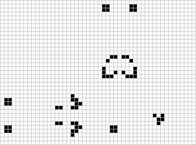

# Conway's Game of Life in Templates

This is a simple implementation of Lazily-Evaluated Conway's Game of Life,
computed at compile time using C++ templates.

This particular example will compute
[New Gun 1](https://conwaylife.com/wiki/New_gun_1), which is a simple periodic
gun that will emit a glider every 46 steps.



# Parts

This program is divided up into 4 parts:

- Initial State machinery - defines the initial state of the program
- `Cell<T, X, Y>` template, whose value determines the state of the cell at the
  given X and Y coordinates, and time T
- Snapshot machinery - "reads" state from the `Cell` template, and outputs it
  into a 2-D array of bools containing the state at the given time `T`, for the
  given rectangle of cells.
- Display machinery - this just prints out snapshots.

I will expand more on these first two parts, which are actually needed for the
engine, below.

## Initial State

For convinience, the initial state is represented as a string and stored in a 1D
array. This string is then queried as though it's a 2D array, in order to get
the initial state of any cell, given an X and Y coordinate.

We use `.` to represent dead cells, and `O` to represent living cells, because
that's the representation provided
[here][https://conwaylife.com/patterns/p46gun.cells] by the Game of Life wiki.

```cpp
template <int W, int H, char living = 'O'>
struct InitialState {
    char state[W * H + 1];

    constexpr int operator()(int i, int j) const {
        return i < 0 || i >= W || j < 0 || j >= H
                 ? 0
                 : int(state[i + j * W] == living);
    }
};

// Based on https://conwaylife.com/wiki/New_gun_1
constexpr InitialState<49, 14> initial_state {
    "..............................OO................."
    ".............................O.O...............OO"
    ".............................O.................OO"
    ".................O...........OOO................."
    "OO...............OO.............................."
    "OO................OO............................."
    ".............OO..OO.............................."
    ".............................OOO................."
    ".............................O.................OO"
    ".............................O.O...............OO"
    ".............OO..OO...........OO................."
    "OO................OO............................."
    "OO...............OO.............................."
    ".................O..............................."};
```

## Representing cells

Each cell has a single static datamember, `value`. For cells with `T > 0`, this
is computed based off the state of neighboring cells at `(T - 1)`, and for
`T == 0` this is computed based on the initial state:

```cpp
constexpr int next_state(int previous_state, int previous_living_neighbors) {
    return previous_living_neighbors == 2 //
             ? previous_state
             : previous_living_neighbors == 3 ? 1 : 0;
}

template <int T, int X, int Y>
struct Cell {
    constexpr static int previous_living_neighbors() {
        return Cell<T - 1, X - 1, Y - 1>::value //
             + Cell<T - 1, X - 1, Y>::value     //
             + Cell<T - 1, X - 1, Y + 1>::value //
             + Cell<T - 1, X, Y - 1>::value     //
             + Cell<T - 1, X, Y + 1>::value     //
             + Cell<T - 1, X + 1, Y - 1>::value //
             + Cell<T - 1, X + 1, Y>::value     //
             + Cell<T - 1, X + 1, Y + 1>::value;
    }
    constexpr static int previous_state() { return Cell<T - 1, X, Y>::value; }

    constexpr static int value = next_state(
        previous_state(),
        previous_living_neighbors());
};

template <int X, int Y>
struct Cell<0, X, Y> {
    constexpr static int value = initial_state(X, Y);
};
```

Here,

- `next_state` computes the next state of a cell,
- `previous_living_neighbors` counts the number of living neighbors a cell had
  in the previous generation,
- `previous_state()` gets the state the cell previously had.

`T` represents time, and `X` and `Y` are the coordinates of the cell within the
grid.

# Displaying the simulation

We display the simulation by taking a 3-dimentional snapshot of the state of the
game. This state is returned as a const reference to a 3-dimensional array,
under the type alias `Snapshots`.

```cpp
// Inside snapshot.h

template <size_t W, size_t H>
using Snapshot = std::array<std::array<bool, W>, H>;

template <size_t T, size_t W, size_t H>
using Snapshots = std::array<Snapshot<W, H>, T>;


constexpr size_t NumSnapshots = 92;
auto get_snapshot() -> Snapshots<NumSnapshots, 60, 30> const&;
```

```cpp
// inside conway.cpp
auto get_snapshot() -> Snapshots<NumSnapshots, 60, 30> const& {
    constexpr static auto result = snapshot_sequence<-5, -5, 60, 30>(
        int_seq<NumSnapshots> {});

    return result;
}
```

Because the period of the gun is 46, we take 92 snapshots (two full periods).
This allows us to play the latter 46 snapshots in an infinite loop during the
actual display of the game:

```cpp
int main() {
    auto const& result = get_snapshot();
    size_t i = 0;
    while(true) {
        auto& ss = result[i];
        i += 1;
        // This particular configuration repeats after 46 steps
        if (i == NumSnapshots) i -= 46;
        print_ss(ss);
        std::this_thread::sleep_for(std::chrono::milliseconds(200));
    }
}
```

# Compiling

You can compile and run the simulation like so:

```
cmake -B build && cmake --build build
build/conway
```

Compiling will take about 5 minutes.

Anyway! I hope you've enjoyed!


